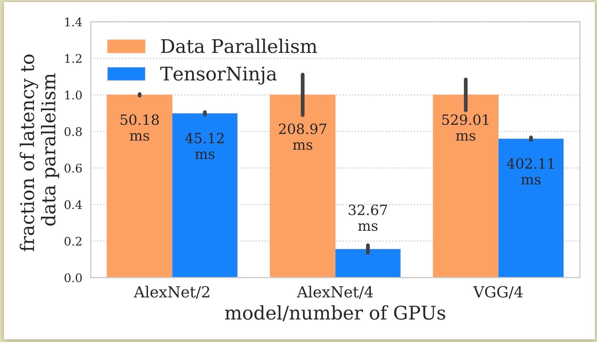

#### Contents
- <a class="scroll" href="#learning-a-concurrency-control-protocol-for-datatabses">Learned concurrency control</a>
- <a class="scroll" href="#tensorninja-finding-the-best-partitioning-of-dataflow-graphs">Tensor partitioning</a>
- <a class="scroll" href="#big-data-analytics-of-epidemic-outbreaks">Epidemiological real-time data exploration</a>

## Learning a concurrency control protocol for datatabses

Over the last year I have led a research team with the aim of using learning
methods (reinforcement learning and genetic algorithms) to learn an overly-specific
concurrency control protocol for some database setup. Protocols such as Optimistic
Concurrency Control and Two Phase Lockingalready operate on certain
assumptions (high vs low contention workloads). We are trying to take this a step
further, and learn a concurrency control protocol that is optimized for specific
database set up (workload, hardware, and software).

We are submitting this work in mid-July (2019), and I will be able to share more
information after that!

## TensorNinja, finding the best partitioning of dataflow graphs
*Work done around 2017 - 2018*
### Summary
Immediately when I started at NYU, I became involved in the following project which
was led by Chine-Chin Huang (also with: Sean Welleck, Minje Wang, Zheng Zhang,
and Jinyang Li).

In this project we aimed to partition tensors in the dataflow graph of deep
neural networks (DNNs) across multiple GPU devices, maximizing training speed
of the DNN. We used reinforcement learning to optimize for this metric, and
wrote
our system to distribute computation for MXNet. Below shows the time needed per
training example for data parallelism (the default partitioning strategy) and
for the partitioning our model found for various DNN models.

### Additional details

Many modern deep learning systems 
(e.g. TensorFlow, MXNet, PyTorch, Theano) need to parallelize
the training of deep neural networks across multiple GPU devices.
The  standard strategy is data parallelism, where each device processes a partition
of the input (i.e. the batch tensor is cut along the batch dimension),
and synchronizes weight updates after each iteration.  Currently,
data parallelism is used across machines (inter-machine
parallelism), as well as across multiple devices within a single machine
(intra-machine parallelism).  However, model parallelization hash shown good
performance in the intra-machine setting, as well as some specific cases of
inter-machine parallelization.

Model parallelism (or more precisely, model partitioning) partitions a weight tensor 
across devices (Another form of model parallelism, which we do not
consider in our project, assigns different weight tensors to different
devices, also known as graph partitioning). It can outperform data parallelism when the mini-batch size used 
is relatively small or fixed.  Small or fixed batch sizes are desirable for two reasons;
[first, training using large batch sizes is generally believed to reduce
accuracy](https://arxiv.org/abs/1609.04836).  [Second,
while some recent work have achieved competitive accuracy 
using large batch training](https://arxiv.org/abs/1706.02677),
there is a limit to enlarging the batch size. By supporting small
batch training for intra-machine parallelism, one can scale to more machines
with the same overall batch size limit.

Our project seeks to determine the *best parallelization strategy* for training
a DNN, given a fixed batch size.
Problems we had to address were 1) there lacks an optimization
framework that unifies all parallelization strategies, including model and data parallelism as
well as different combinations of the two, 2) solving the underlying
optimization problem is NP-hard ([shown in a related project Spartan](https://www.usenix.org/conference/atc15/technical-session/presentation/huang-chien-chin)).
Our team created a  system (TensorNinja) which
addresses the first challenge by viewing each parallelization strategy as a
underlying dataflow graph. Thus, to find the best parallelization  strategy, we
need to solve the optimization problem of finding the best way of partitioning
(or replicating) each tensor in a given dataflow graph.  TensorNinja addresses the second
challenge using reinforcement learning to smartly explore the space to discover
a good partition scheme without relying on any manually-designed heuristic.

## Big Data Analytics of Epidemic Outbreaks
*Work done around 2016*

During my undergraduate studies at Colorado State University, I served as
a research assistant under Shrideep Pallickara for a project centered on
providing real-time analysis of massive epidemiological data for the
Department of Homeland Security.

The motivation of this project was to allow epidemiologists to explore the outcome
of novel scenarios of exotic and highly contagious animal diseases in the United
States, based of some controllable input parameters (such as number of vaccines
available).

Previously this exploration was done using stochastic discrete event simulations,
however these simulations took many CPU hours to complete. This is due to the 
vast number of input parameters and parameter value ranges, and was an unacceptable
delay when trying to respond to a disease outbreak.

Our goal was to keep the expressive of these simulations, while allowing real-time
exploration of inputs and outputs. This was achieved by harvesting huge amounts of
computation and storage (from cloud, idle university computers, etc) to analyze
data from the simulations and create learned models with near instantaneous 
outputs. To this end the parameter space was rigorously explored (using Latin 
Hypercube Sampling) to create a training dataset of representative input/output
pairs. A model was trained using neural networks, linear regression, and 
ensemble methods (gradient boosting and random forests). The model was then compiled
into JavaScript, and served alongside a web tool to allow researchers "what-if"
exploration even from the field (the tool can be seen below).

Due to my contributions to the project, I was selected to travel to Washington
D.C. and present our work at the Department of Homeland Security 
Science & Technology Hill Day 2016, on Capital Hill. An image of our stand
with the program directory Dr. Michelle Colby, my colleague Ryan Stern, and myself can be seen
below (in that order, from left to right).

